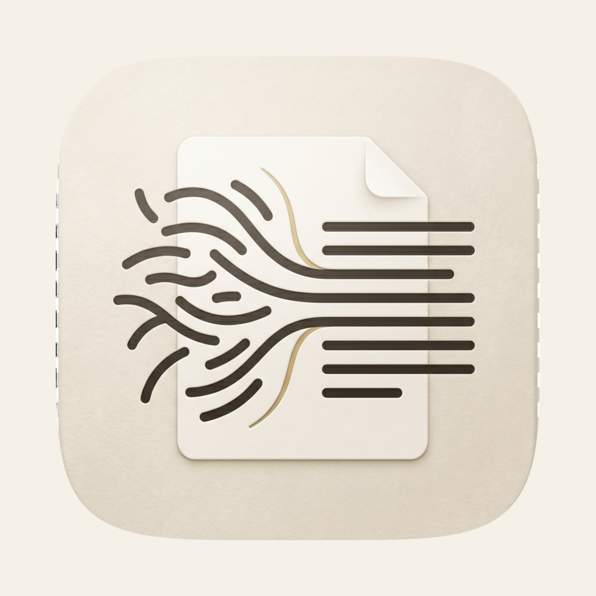
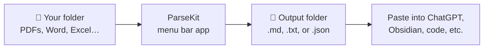

<p align="center">
  
</p>

<h1 align="center">ParseKit</h1>

<p align="center">
  Turn PDFs and Office files into clean text on your Mac — nothing uploaded, no Terminal needed.
</p>

<p align="center">
  <a href="https://github.com/harshabala/parsekit/releases/latest/download/ParseKit_0.2.2_aarch64.dmg"></a>
</p>

<p align="center">
  <a href="https://github.com/harshabala/parsekit/releases/latest"><strong>All releases</strong></a>
  &nbsp;·&nbsp;
  <a href="docs/INSTALL.md">Install help</a>
  &nbsp;·&nbsp;
  <a href="#how-to-use-it">How to use it</a>
</p>

---

## Get ParseKit (3 steps — no git, no coding)

**You do not need to clone this repo or run `npm install`.** That's only for developers. If you just want the app:

| Step | What to do |
|------|------------|
| **1. Download** | Click **[Download DMG](https://github.com/harshabala/parsekit/releases/latest/download/ParseKit_0.2.2_aarch64.dmg)** (Apple Silicon Mac). Or open [Releases](https://github.com/harshabala/parsekit/releases/latest) and grab the `.dmg` under **Assets**. |
| **2. Install** | Open the DMG → drag **ParseKit** into **Applications** → eject the DMG. |
| **3. Open** | Open ParseKit from **Applications**. Look for the icon in your **menu bar** (top-right), not the Dock. |

**Requirements:** macOS 12+, Apple Silicon (M1/M2/M3/M4). First launch may need a one-time security approval — see **[Install guide](docs/INSTALL.md)**.

<details>
<summary><strong>Clicked the green <code>Code</code> button by mistake?</strong></summary>

That copies a git URL for developers. **End users should ignore it.** Use the DMG link above instead.

</details>

---

## What is this?

ParseKit lives in your **menu bar**. Point it at documents, get back `.md`, `.txt`, or `.json` files you can paste into ChatGPT, Obsidian, or any AI tool.

- **Private** — parsing happens on your Mac
- **Batch** — drop a whole folder at once
- **OCR built in** — scanned PDFs work offline

**Good for:** contracts, research papers, Word docs, slide decks, scanned pages.  
**Not for:** editing files, Windows/Linux, or pixel-perfect layout recreation.

## See it in 30 seconds



1. Click the ParseKit icon in the menu bar.
2. Pick an output folder.
3. Drag in files or a folder.
4. Hit **Run Parse**.
5. Open the output folder.

## How to use it

### The main screen

| Step | What to do |
|------|------------|
| 1 | Choose an **output folder** |
| 2 | **Drop files or a folder**, or use Select Files / Select Folder |
| 3 | Click **Run Parse** |

### Output formats

| Format | Best for |
|--------|----------|
| **Markdown** (.md) | Notes apps, AI chat |
| **Plain text** (.txt) | Simple copy-paste |
| **JSON** (.json) | Code, spreadsheets, RAG pipelines |

### File types

| Type | Examples | Notes |
|------|----------|-------|
| PDF | `.pdf` | Works immediately. OCR for scans. |
| Word / PowerPoint | `.docx`, `.pptx`, … | Needs free [LibreOffice](https://www.libreoffice.org/) |
| Spreadsheets | `.xlsx`, `.csv` | Always → JSON |
| Images | `.png`, `.jpg` | Needs `brew install imagemagick` |

ParseKit shows what's missing under **Settings → Optional converters**.

### Right-click in Finder (Quick Action)

After installing the Quick Action in **Settings → Finder**:

> Right-click a PDF → **Quick Actions** → **Parse to Markdown with ParseKit**

The menu item is **not** called "Convert to Markdown" — that's usually a different app or macOS shortcut. ParseKit's action name includes **ParseKit** in it.

If you've set an output folder, it parses silently and notifies you when done. Otherwise ParseKit opens with the file loaded.

### Settings worth knowing

| Setting | What it does |
|---------|--------------|
| **App language** | English, 中文, Español |
| **Appearance** | Light, dark, or system |
| **Launch at login** | Start with macOS |
| **Updates** | In-app update from GitHub Releases |

## Privacy

- Files stay on your Mac
- No analytics or accounts
- Parsing uses no network (updates and optional OCR language downloads are separate)

## Troubleshooting

| Problem | Fix |
|---------|-----|
| App blocked on first launch | [Install guide](docs/INSTALL.md#step-3--first-launch-the-annoying-part) |
| Can't find the app | Menu bar only — check the `›` overflow area |
| Office files fail | Install LibreOffice, hit **Recheck** in Settings |
| Wrong Finder menu item | Use **Parse to Markdown with ParseKit**, not "Convert to Markdown" |
| Update fails | Re-download the [latest DMG](https://github.com/harshabala/parsekit/releases/latest) |

More help: **[docs/INSTALL.md](docs/INSTALL.md)** · **[docs/README.md](docs/README.md)**

## For developers

Clone only if you're building or contributing:

```bash
git clone https://github.com/harshabala/parsekit.git
cd parsekit
npm install
npm run build:sidecar   # first run: ~10 min
npm run tauri dev
```

Release and updater notes: **[docs/RELEASING.md](docs/RELEASING.md)**

## License

Apache-2.0 — see [LICENSE](LICENSE). Third-party notices in [NOTICE.md](NOTICE.md).

## Credits

**Built by** [Harsha Balakrishnan](https://github.com/harshabala), with development help from **Claude** (Anthropic), **Grok** (xAI), and **Gemini** (Google) coding agents. Details in **[docs/ACKNOWLEDGMENTS.md](docs/ACKNOWLEDGMENTS.md)**.

**Powered by** [LiteParse v2](https://github.com/run-llama/liteparse) · [Tauri](https://tauri.app) · [Svelte](https://svelte.dev)