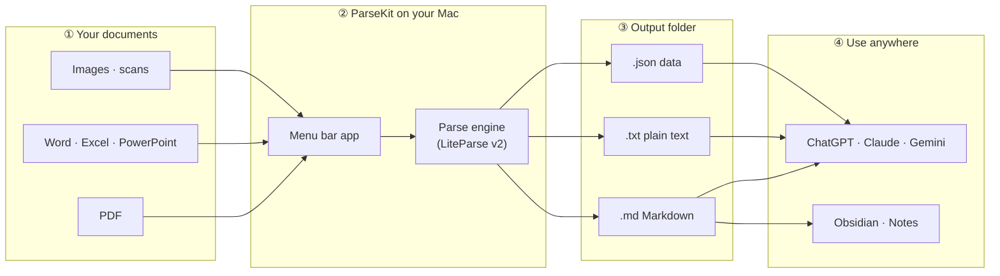
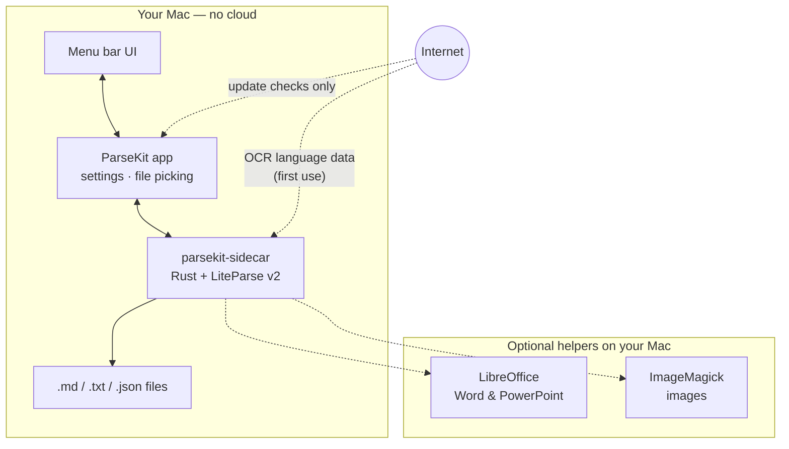

<p align="center">
  
</p>

<h1 align="center">ParseKit</h1>

<h3 align="center">Turn documents into AI-ready Markdown</h3>

<p align="center">
  <a href="https://github.com/harshabala/parsekit/releases/latest/download/ParseKit_0.2.4_aarch64.dmg"><strong>Download for Mac (Apple Silicon)</strong></a>
  &nbsp;·&nbsp;
  <a href="docs/INSTALL.md">Install guide</a>
</p>

ParseKit is a native macOS menu-bar app that converts PDFs, Office files, spreadsheets, and images into clean Markdown, plain text, or JSON — entirely on your Mac.

Raw PDFs and Office files carry layout noise, repeated headers/footers, and broken line wraps that inflate token count without adding meaning, and scanned pages aren't readable as text at all without OCR. ParseKit strips that noise locally, so more of a document's actual content fits into a single ChatGPT/Claude/Gemini context window — and teams ingesting documents in bulk (RAG pipelines, internal chat tools, batch summarization) can process more files before hitting a tokens-per-minute rate limit. It's noise removal, not compression — see the honest numbers below rather than a marketing claim.

**Private · Batch · OCR · Offline · No API keys · No subscriptions**

## How it works



**In plain terms:**

1. Click the ParseKit icon in your menu bar.
2. Drop in a folder of PDFs, Office files, or images.
3. ParseKit converts them on your Mac — nothing is uploaded.
4. Open the output folder and paste the results into your AI tool or notes app.

<details>
<summary><strong>What's happening under the hood?</strong></summary>



Your files are read and written only on your machine. The only network calls are optional: checking for app updates, and downloading OCR language packs the first time you need them.

</details>

---

## Why it matters for AI workflows

LLMs read text, not PDF layout. Naive extraction — copy-paste from Preview, raw `pdftotext`, dumping Office XML — carries formatting noise that costs tokens without adding meaning, and scanned pages need OCR before there's any text to read at all. ParseKit produces structured Markdown with page markers, and runs OCR on scans, so what you paste into an AI tool is closer to pure signal.

**Measured, reproducible numbers:** [`docs/benchmark-results.md`](docs/benchmark-results.md) — generated by [`scripts/benchmark_tokens.py`](scripts/benchmark_tokens.py), which runs the real `parsekit` CLI against a set of fixture documents and compares token counts against a naive, no-cleanup extraction (what you'd get without ParseKit). Numbers aren't hand-edited into this README; run the script on your own documents to reproduce them.

**Business framing:** if your team ingests documents into LLM workflows at any volume, lower tokens per document is a throughput argument, not just a cost one — it's the difference between how many files you can push through before a rate-limit window resets.

## How people actually use it

1. **Scanned contract into Claude/ChatGPT** — right-click the PDF → Quick Actions → Parse to Markdown with ParseKit → paste clean text into chat instead of uploading a scan the model struggles to read.
2. **Consultant batch-prepping client docs** — drop a folder of Word files, PDFs, and decks into ParseKit, run once, feed the output folder into a Claude Project or RAG index.
3. **Developer RAG pipeline** — add `parsekit convert ./inbox --batch --out ./markdown` as a preprocessing step. Offline, no third-party upload of sensitive documents.
4. **AI coding agent mid-task** — before reading a PDF spec into context, run `parsekit convert spec.pdf --out /tmp/spec.md` and read the Markdown instead, preserving context budget for the actual task. See [skills/parsekit/SKILL.md](skills/parsekit/SKILL.md).

---

## Finder Quick Actions

Right-click any supported file in Finder → **Quick Actions** → **Parse to Markdown with ParseKit**.

- If you've set an output folder in ParseKit, files parse silently and you get a notification.
- Otherwise ParseKit opens with the files loaded.
- Also available in **System Settings → Keyboard → Keyboard Shortcuts → Services** (same Automator workflows).

**Replace Original (opt-in):** a second action, **Parse to Markdown with ParseKit (Replace Original)**, moves the original to Trash after a *successful* parse only — always recoverable from Trash.

Install both from **Settings → General → Finder**.

## Settings

| Tab | What it controls |
| --- | --- |
| **General** | Language, appearance, launch at login, Gatekeeper help, Finder actions, updates, global hotkey (⌃⇧M), token savings counter |
| **File Support** | OCR language, OCR threads, **required converters** — LibreOffice for Word/PowerPoint, ImageMagick for images. PDF parsing works without these. |

If a `.docx` fails to convert, open **Settings → File Support** — the converter checklist shows what's missing.

**Token savings counter:** ParseKit tracks tokens saved locally (no telemetry) — a quiet line in the popover, full breakdown in Settings. Scanned pages get a separate **pages unlocked** stat rather than being folded into the token count.

**First launch blocked?** Run once in Terminal:

```bash
xattr -cr /Applications/ParseKit.app
```

Or use **Settings → General → Copy fix command**, then open Privacy & Security.

---

## Features

- Local-first processing — files never leave your Mac
- Native macOS menu-bar app
- Markdown, plain text, or JSON export
- OCR for scanned documents
- Finder Quick Actions + macOS Services menu
- Global hotkey (⌃⇧M) and clipboard-to-Markdown
- `parsekit` CLI for scripts and agents
- Local token savings counter, no telemetry
- Optional floating progress HUD for background batches

## Get ParseKit

**You don't need `git clone`.** End users install the DMG:

1. [Download the DMG](https://github.com/harshabala/parsekit/releases/latest/download/ParseKit_0.2.4_aarch64.dmg) (macOS 12+, Apple Silicon)
2. Open it → drag **ParseKit** to **Applications**
3. Open from Applications → look for the icon in your **menu bar** (top-right)

First-launch security steps: [docs/INSTALL.md](docs/INSTALL.md)

## Privacy

Everything runs locally — files, OCR, and conversion never touch a server. No cloud processing, no telemetry, no tracking.

## For AI coding agents

ParseKit ships an agent skill at [skills/parsekit/SKILL.md](skills/parsekit/SKILL.md). Point your agent at [AGENTS.md](AGENTS.md) so it knows to run `parsekit convert` before reading PDFs or Office files into context.

```bash
parsekit convert /path/to/spec.pdf --out /tmp/spec.md
```

macOS Shortcuts / App Intents integration is planned for a later release.

## For developers

```bash
git clone https://github.com/harshabala/parsekit.git
cd parsekit
npm install
npm run build:sidecar
npm run tauri dev
```

Release notes: [docs/RELEASING.md](docs/RELEASING.md)

## Credits

Created and crafted by [Harsha Balakrishnan](https://github.com/harshabala).

Development help from Claude (Anthropic), Grok (xAI), and Gemini (Google) coding agents — see [docs/ACKNOWLEDGMENTS.md](docs/ACKNOWLEDGMENTS.md).

Powered by [LiteParse v2](https://github.com/run-llama/liteparse) · [Tauri](https://tauri.app) · [Svelte](https://svelte.dev)

Apache-2.0 — see [LICENSE](LICENSE)
