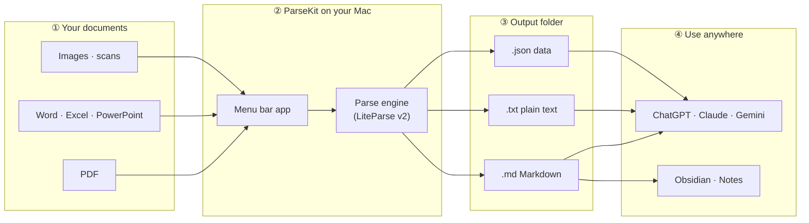
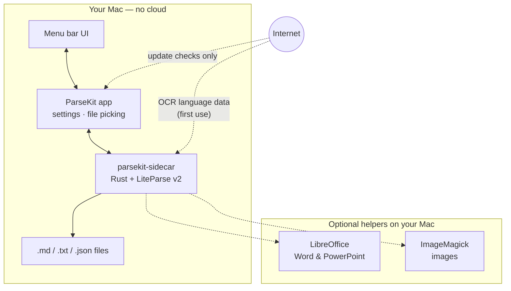

<p align="center">
  
</p>

<h1 align="center">ParseKit</h1>

<h3 align="center">Turn documents into AI-ready Markdown</h3>

<p align="center">
  <a href="https://github.com/harshabala/parsekit/releases/latest/download/ParseKit_0.2.3_aarch64.dmg"><strong>Download for Mac (Apple Silicon)</strong></a>
  &nbsp;·&nbsp;
  <a href="docs/INSTALL.md">Install guide</a>
</p>

ParseKit is a native macOS menu-bar app that converts PDFs, Office files, spreadsheets, and images into clean Markdown, plain text, or JSON — entirely on your Mac.

**Why it matters for AI workflows:** Raw PDFs and Office files carry layout noise, repeated headers/footers, and broken line wraps that inflate token count without adding meaning. Feeding cleaner Markdown into ChatGPT, Claude, or a RAG pipeline means more document content fits in a single context window — and teams hitting **tokens-per-minute rate limits** can process more files before the limit window resets. ParseKit removes that noise locally; it is not magic compression.

Private · Batch · OCR · Offline · No API keys.

## How it works



**In plain terms:**

1. Click the ParseKit icon in your menu bar.
2. Drop in a folder of PDFs, Office files, or images.
3. ParseKit converts them on your Mac — nothing is uploaded.
4. Open the output folder and paste the results into your AI tool or notes app.

<details>
<summary><strong>What's happening under the hood?</strong></summary>



Your files are read and written only on your machine. The only network calls are optional: checking for app updates, and downloading OCR language packs the first time you need them.

</details>

---

## Why this matters for AI workflows

LLMs read text, not PDF layout. Naive extraction — copy-paste from Preview, raw `pdftotext`, or dumping Office XML — often includes headers, footers, column artifacts, and broken wraps. That burns tokens on formatting noise instead of content.

ParseKit produces structured Markdown with page markers and OCR for scans. On real multi-page reports and scanned documents, measured token reduction can be substantial; on tiny clean files, savings may be modest or zero — see the benchmark below.

| Fixture | Baseline cl100k | ParseKit cl100k | Δ |
| --- | ---: | ---: | ---: |
| born-digital.pdf | 53 | 63 | 0.0% |
| scanned.pdf | 0 | 31 | OCR unlocks text |
| sample.docx | 31 | 41 | 0.0% |
| slides.pptx | 19 | 32 | 0.0% |
| spreadsheet.xlsx | 19 | 641 | 0.0% |

*Synthetic minimal fixtures — reproduce on your documents:* [`scripts/benchmark_tokens.py`](scripts/benchmark_tokens.py) · full results in [`docs/benchmark-results.md`](docs/benchmark-results.md)

**Business framing:** If your team ingests documents into LLM workflows (RAG, internal chat, batch summarization), lower tokens per document directly improves throughput under rate limits — not just cost.

---

## How people actually use it

1. **Scanned contract into Claude/ChatGPT** — Right-click the PDF → Quick Actions → Parse to Markdown with ParseKit → paste clean text into chat instead of uploading a scan the model struggles to read.

2. **Consultant batch-prepping client docs** — Drop a folder of Word files, PDFs, and decks into ParseKit → one Run Parse → feed the output folder into a Claude Project or RAG index.

3. **Developer RAG pipeline** — Add `parsekit convert ./inbox --batch --out ./markdown` as a preprocessing step. Offline, no third-party upload of sensitive documents.

4. **AI coding agent mid-task** — Before reading a PDF spec into context, run `parsekit convert spec.pdf --out /tmp/spec.md` and read the Markdown — preserves context budget for the actual task. See [skills/parsekit/SKILL.md](skills/parsekit/SKILL.md).

---

## Finder Quick Actions (works today)

Right-click any supported file in Finder → **Quick Actions** → **Parse to Markdown with ParseKit**.

- If you have set an output folder in ParseKit, files parse silently and you get a notification.
- Otherwise ParseKit opens with the files loaded.

Also available in **System Settings → Keyboard → Keyboard Shortcuts → Services** (same Automator workflows).

**Replace Original (opt-in):** A second action — **Parse to Markdown with ParseKit (Replace Original)** — moves the original to Trash after a *successful* parse only (recoverable from Trash).

Install both from **Settings → General → Finder**.

---

## Settings worth knowing

| Tab | What it controls |
| --- | --- |
| **General** | Language, appearance, launch at login, Gatekeeper help, Finder actions, updates, global hotkey (⌃⇧M), token savings counter |
| **File Support** | OCR language, OCR threads, **required converters** — LibreOffice for Word/PowerPoint, ImageMagick for images. PDF parsing works without these. |

If a `.docx` fails, open **Settings → File Support** — the converter checklist shows what is missing.

**Token savings counter:** ParseKit tracks tokens saved locally on your Mac (no telemetry). See the quiet line in the popover or the full breakdown in Settings. Scanned pages show a separate **pages unlocked** stat — not mixed with token savings.

**First launch blocked?** Run once in Terminal:

```bash
xattr -cr /Applications/ParseKit.app
```

Or use **Settings → General → Copy fix command** and open Privacy & Security.

---

## Why ParseKit?

Large language models work best with clean, structured text.

Unfortunately, PDFs, Office documents, and scanned files often require unnecessary parsing before the model can understand your content.

ParseKit converts those documents into structured Markdown locally on your Mac, making them easier to use with ChatGPT, Claude, Gemini, Codex, and other AI tools.

Everything happens on-device.

No cloud upload.

No subscriptions.

No API keys.

---

## Features

- Local-first processing
- Native macOS menu-bar app
- AI-ready Markdown, plain text, JSON export
- OCR for scanned documents
- Finder Quick Actions + macOS Services menu
- Global hotkey (⌃⇧M) and clipboard-to-Markdown
- `parsekit` CLI for scripts and agents
- Local token savings counter (no telemetry)
- Optional floating progress HUD for background batches
- Privacy-first — no cloud processing

---

## Why Markdown?

Markdown is a clean, structured format that both humans and language models understand well.

Converting documents once before sharing them with an AI assistant helps:

- eliminate repeated parsing
- preserve document hierarchy
- create cleaner context
- improve prompt quality
- reduce unnecessary formatting overhead

ParseKit focuses on cleaner context and lower parsing overhead — not a promise that Markdown always uses fewer tokens.

---

## Get ParseKit

**You do not need `git clone`.** End users install the DMG:

1. **[Download the DMG](https://github.com/harshabala/parsekit/releases/latest/download/ParseKit_0.2.3_aarch64.dmg)** (macOS 12+, Apple Silicon)
2. Open it → drag **ParseKit** to **Applications**
3. Open from Applications → look for the icon in your **menu bar** (top-right)

First-launch security steps: **[docs/INSTALL.md](docs/INSTALL.md)**

---

## Privacy

Everything runs locally.

Your files never leave your Mac.

No cloud processing.

No telemetry.

No tracking.

---

## For AI coding agents

ParseKit ships an agent skill at **[skills/parsekit/SKILL.md](skills/parsekit/SKILL.md)**. Point your agent at **[AGENTS.md](AGENTS.md)** so it knows to run `parsekit convert` before reading PDFs and Office files into context.

```bash
parsekit convert /path/to/spec.pdf --out /tmp/spec.md
```

macOS Shortcuts / App Intents integration is planned for a later release.

---

## For developers

```bash
git clone https://github.com/harshabala/parsekit.git
cd parsekit
npm install
npm run build:sidecar
npm run tauri dev
```

Release notes: **[docs/RELEASING.md](docs/RELEASING.md)**

---

## Credits

Created and crafted by [Harsha Balakrishnan](https://github.com/harshabala).

Development help from Claude (Anthropic), Grok (xAI), and Gemini (Google) coding agents — see **[docs/ACKNOWLEDGMENTS.md](docs/ACKNOWLEDGMENTS.md)**.

Powered by [LiteParse v2](https://github.com/run-llama/liteparse) · [Tauri](https://tauri.app) · [Svelte](https://svelte.dev)

Apache-2.0 — see [LICENSE](LICENSE)