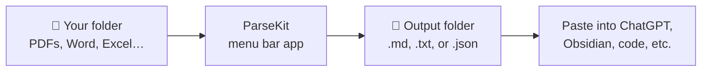
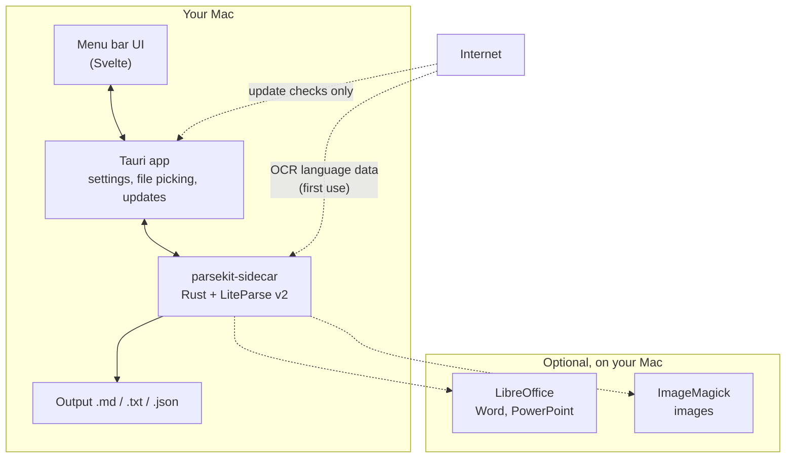

<p align="center">
  
</p>

<h1 align="center">ParseKit</h1>

<p align="center">
  Turn a folder of PDFs and Office files into clean text files — on your Mac, without uploading anything anywhere.
</p>

<p align="center">
  <a href="https://github.com/harshabala/parsekit/releases/latest"><strong>Download for Mac (Apple Silicon)</strong></a>
  &nbsp;·&nbsp;
  <a href="#how-to-use-it">How to use it</a>
  &nbsp;·&nbsp;
  <a href="docs/INSTALL.md">Install help</a>
</p>

---

## What is this?

ParseKit is a small Mac app that lives in your **menu bar** (the strip of icons at the top-right of your screen). You point it at a folder of documents, and it spits out readable text files you can paste into ChatGPT, Claude, a notes app, or whatever you use.

Nothing gets uploaded. Parsing happens on your Mac. You don't need to open Terminal for normal use.

**Good for:**
- A pile of PDF contracts you want to search or summarize
- Research papers you need as plain text
- Word docs and PowerPoints before feeding them to an AI
- Scanned documents (OCR is built in)

**Not good for:**
- Editing documents (ParseKit only reads and exports)
- Windows or Linux (macOS only for now)
- Perfect layout preservation (you get text, not a pixel-perfect replica)

## See it in 30 seconds



1. Click the ParseKit icon in the menu bar.
2. Pick an output folder (where converted files go).
3. Drag in files or a whole folder.
4. Hit **Run Parse**.
5. Open the output folder and grab your files.

That's the whole job.

## Download and install

**Requirements:** macOS 12 (Monterey) or newer. Apple Silicon Mac (M1/M2/M3/M4). An Intel build isn't published yet.

1. Go to **[Releases](https://github.com/harshabala/parsekit/releases/latest)** and download `ParseKit_*_aarch64.dmg`.
2. Open the DMG. You'll see a window that says to drag ParseKit into Applications — do that. Don't run it straight from the DMG.
3. Eject the DMG, quit any copy that was running from it, then open **ParseKit** from your Applications folder.

macOS may block the app the first time because it isn't notarized. That's normal for indie Mac apps. Full step-by-step with screenshots-level detail is in **[docs/INSTALL.md](docs/INSTALL.md)**.

> **Where did it go?** ParseKit doesn't show up in the Dock. Look for its icon in the menu bar at the top of your screen. If you don't see it, click the `›` chevron on the left side of the menu bar to reveal hidden icons.

## How to use it

### The main screen

When you click the menu bar icon, a panel drops down. The first-run checklist walks you through three steps:

| Step | What to do |
|------|------------|
| 1 | Choose an **output folder** — this is where your converted files land |
| 2 | **Drop files or a folder** into the drop zone, or use Select Files / Select Folder |
| 3 | Click **Run Parse** |

While it runs, you'll see a progress list per file. When it's done, hit **Open Output** to jump straight to the results in Finder.

### Output formats

| You pick | You get | Best for |
|----------|---------|----------|
| **Markdown** (.md) | Headings, page breaks, readable structure | Notes apps, AI chat, GitHub |
| **Plain text** (.txt) | Just the words, no formatting | Simple copy-paste |
| **JSON** (.json) | Structured data with metadata | Code, databases, RAG pipelines |

Spreadsheets (`.xlsx`, `.csv`, etc.) always export as JSON — that's intentional, tables don't map cleanly to Markdown.

### What file types work?

| Type | Examples | Notes |
|------|----------|-------|
| PDF | `.pdf` | Works out of the box. Scanned PDFs use built-in OCR. |
| Word | `.doc`, `.docx`, `.odt`, `.rtf` | Needs [LibreOffice](https://www.libreoffice.org/) installed (free) |
| PowerPoint | `.ppt`, `.pptx`, `.odp` | Same — LibreOffice |
| Spreadsheets | `.xls`, `.xlsx`, `.csv`, `.tsv` | Always → JSON |
| Images | `.png`, `.jpg`, `.webp`, `.svg` | Needs [ImageMagick](https://imagemagick.org/) (`brew install imagemagick`) |

PDFs work immediately. Office docs and images need optional tools — ParseKit tells you what's missing in **Settings → Optional converters**. Missing LibreOffice won't stop your PDFs from working.

### OCR (reading scanned pages)

OCR is on by default. If a PDF is a scan (a photo of a page, not selectable text), ParseKit reads it with Tesseract, which is bundled inside the app.

- Toggle it off if you only have digital PDFs and want faster runs.
- Change the document language under **Settings → OCR language** if your scans aren't in English.
- Heavy OCR batches? Lower **Settings → Advanced → OCR threads** to 1–2 so your Mac doesn't choke.

### Finder Quick Action

In **Settings → Finder**, you can install a right-click shortcut:

> Right-click a file in Finder → **Quick Actions** → **Parse to Markdown with ParseKit**

If you've already set an output folder, it runs silently. Otherwise ParseKit opens with the file loaded.

### Settings worth knowing

| Setting | What it does |
|---------|--------------|
| **App language** | English, 中文, Español — changes the UI, not your exported files |
| **Appearance** | Light, dark, or follow system |
| **Launch at login** | ParseKit starts when you sign in |
| **Updates** | Checks GitHub for new versions; install from the gold banner |

## How it works (under the hood)

ParseKit is a native Mac shell around **[LiteParse v2](https://github.com/run-llama/liteparse)** — a Rust library that extracts text from documents locally. No API keys, no cloud, no account.



Your files never leave the machine during parsing. The only network calls are optional: checking for app updates, and downloading OCR language packs the first time you need them.

## Privacy

Straight answer:

- Files are read from and written to your Mac. Period.
- No analytics, no telemetry, no accounts.
- Parsing itself uses zero network. Updates and OCR language downloads are the only things that might hit the internet, and you control updates.

## Troubleshooting

| Problem | Fix |
|---------|-----|
| "App can't be opened" on first launch | Right-click ParseKit → **Open** → confirm. Or see [docs/INSTALL.md](docs/INSTALL.md). |
| Can't find ParseKit after opening | It's menu-bar only. Check the top-right of your screen, including behind the `›` overflow menu. |
| Office files fail, PDFs work | Install LibreOffice. ParseKit will show it as missing in Settings. |
| Images fail | `brew install imagemagick`, then hit **Recheck** in Settings. |
| Parse seems stuck | Cancel, drop **OCR threads** to 1–2 in Settings → Advanced, try again with fewer files. |
| Update banner won't install | Download the latest DMG from [Releases](https://github.com/harshabala/parsekit/releases) manually. |

## Automatic updates

ParseKit checks for updates when it launches (and when you tap **Check for updates** in Settings). If a new version exists, a gold banner offers **Install & Restart**.

Updates download a signed `.app.tar.gz` from GitHub Releases and swap the app in place. You don't need to re-download the DMG for every update.

## For developers

Want to hack on ParseKit or build from source?

**Prerequisites:** macOS 12+, Node.js 20+, Rust, and optionally LibreOffice + ImageMagick for full format coverage.

```bash
git clone https://github.com/harshabala/parsekit.git
cd parsekit
npm install
npm run build:sidecar   # first run: ~10 min (compiles LiteParse + Tesseract)
npm run tauri dev
```

`npm run tauri:dev:fast` skips the sidecar rebuild if you already built it.

The `sidecar/` folder is dev-only (Node test harness). The shipped app runs the Rust `parsekit-sidecar` binary bundled inside the `.app`.

### Release build (maintainers)

`src-tauri/binaries/` is gitignored. To package:

```bash
npm run release:macos    # build + sign + DMG
npm run publish:macos    # above + upload to GitHub Releases
```

Build on the target Mac (Apple Silicon vs Intel) so the sidecar binary matches the host.

Updater details, signing keys, and the `parsekit-latest.json` manifest naming quirk are documented in **[docs/RELEASING.md](docs/RELEASING.md)**.

### Stack

| Piece | Role |
|-------|------|
| [Tauri v2](https://tauri.app) | Native Mac app, system tray, updater |
| [Svelte 5](https://svelte.dev) | Popover UI |
| [LiteParse v2](https://github.com/run-llama/liteparse) | Document parsing engine |
| Tauri Store | Settings and batch history |

## License

Apache-2.0 — see [LICENSE](LICENSE). Third-party notices in [NOTICE.md](NOTICE.md).

## Credits

- [LiteParse](https://github.com/run-llama/liteparse) by LlamaIndex — parsing engine
- [Tauri](https://tauri.app) — app framework
- [Svelte](https://svelte.dev) — UI